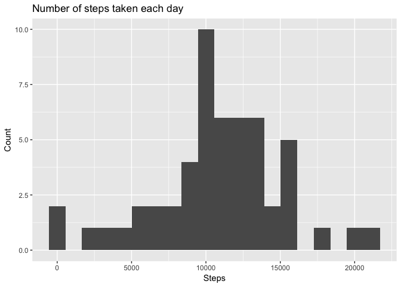
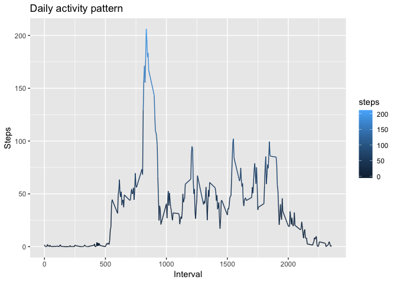
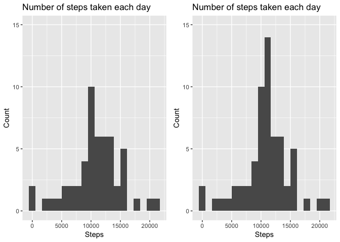
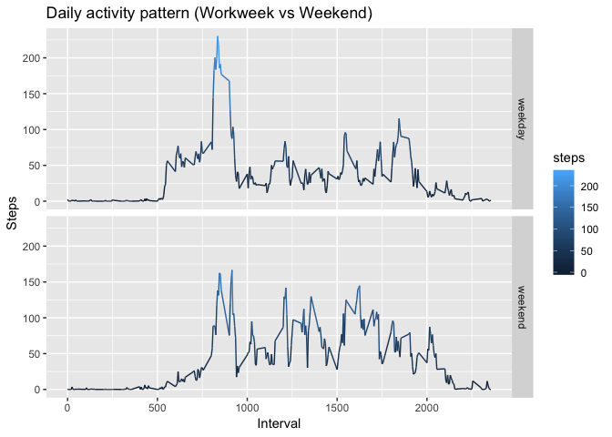

Load necessary libraries

```r
library(ggplot2)
library(dplyr)
library(gridExtra)
```

#### Loading and preprocessing the data

```r
file <- tempfile()
data <- read.csv(file = unzip("activity.zip", exdir = file), header = TRUE, stringsAsFactors = FALSE)
rm(file)
data <- data %>% mutate(date = as.Date(date, format = "%Y-%m-%d"))
```

### Histogram of the total number of steps taken each day

```r
data_day_gr <- data %>% subset(!is.na(steps)) %>% group_by(date) %>% summarise(steps = sum(steps)) %>% arrange(date)
plot1 <- ggplot(data_day_gr, aes(x = steps)) + 
    geom_histogram(bins = 20) + 
    labs(title = "Number of steps taken each day", x = "Steps", y = "Count")
plot1
```

<!-- -->

### Mean/median of the total number of steps taken per day
**Mean**

```r
mean(data_day_gr$steps,na.rm = TRUE)
```

```
## [1] 10766.19
```
**Median**

```r
median(data_day_gr$steps)
```

```
## [1] 10765
```

### Average daily activity pattern

```r
data_interval_gr <- data %>% subset(!is.na(steps)) %>% group_by(interval) %>% summarise(steps = mean(steps)) %>% arrange(interval)
ggplot(data_interval_gr, aes(y = steps, x = interval, color = steps)) + geom_line() + labs(title = "Daily activity pattern", x = "Interval", y = "Steps")
```

<!-- -->

### 5-min. interval with maximum number of steps on average

```r
data_interval_gr %>% filter(max(steps)==steps)
```

```
## # A tibble: 1 x 2
##   interval steps
##      <int> <dbl>
## 1      835  206.
```

### Imputing missing values
1. Calculate and report the total number of missing values in the dataset **(i.e. the total number of rows with NAs)**

```r
sum(!complete.cases(data))
```

```
## [1] 2304
```
2. Devise a strategy for filling in all of the missing values in the dataset. The strategy does not need to be sophisticated. For example, you could use the mean/median for that day, or the mean for that 5-minute interval, etc.

> Mean for each 5-minute interval

3. Create a new dataset that is equal to the original dataset but with the missing data filled in.

```r
data_inputed <- data
for (i in which(is.na(data))){
    data_inputed[i,"steps"] <- subset(data_interval_gr,
                                      interval==data[i,"interval"],
                                      select = steps)
}
head(data_inputed)
```

```
##       steps       date interval
## 1 1.7169811 2012-10-01        0
## 2 0.3396226 2012-10-01        5
## 3 0.1320755 2012-10-01       10
## 4 0.1509434 2012-10-01       15
## 5 0.0754717 2012-10-01       20
## 6 2.0943396 2012-10-01       25
```
4. Make a histogram of the total number of steps taken each day and Calculate and report the **mean** and **median** total number of steps taken per day. Do these values differ from the estimates from the first part of the assignment? What is the impact of imputing missing data on the estimates of the total daily number of steps?

> Tend to increment the count of days with a value of steps near to the mean.


```r
data_day_gr_inputed <- data_inputed %>% subset(!is.na(steps)) %>% group_by(date) %>% summarise(steps = sum(steps)) %>% arrange(date)
plot2 <- ggplot(data_day_gr_inputed, aes(x = steps)) + 
    geom_histogram(bins = 20) + 
    labs(title = "Number of steps taken each day", x = "Steps", y = "Count") +
    ylim(0,15)
grid.arrange(plot1+ylim(0,15), plot2, nrow=1, ncol=2)
```

<!-- -->

**Mean**

```r
mean(data_day_gr_inputed$steps)
```

```
## [1] 10766.19
```

**Median**

```r
median(data_day_gr_inputed$steps)
```

```
## [1] 10766.19
```

### Differences in activity patterns between weekdays and weekends

```r
weekdays <- weekdays(data_day_gr_inputed$date)
is.weekend <- weekdays == "Saturday"| weekdays == "Sunday"
is.weekend <- factor(is.weekend, levels = c(FALSE,TRUE), labels = c("weekday","weekend"))
df_wd <- cbind(data_day_gr_inputed,is.weekend)
head(df_wd)
```

```
##         date    steps is.weekend
## 1 2012-10-01 10766.19    weekday
## 2 2012-10-02   126.00    weekday
## 3 2012-10-03 11352.00    weekday
## 4 2012-10-04 12116.00    weekday
## 5 2012-10-05 13294.00    weekday
## 6 2012-10-06 15420.00    weekend
```

```r
data_interval_gr_wk <- merge(data_inputed, df_wd[,-2], by = "date") %>% group_by(is.weekend,interval) %>% summarise(steps = mean(steps)) %>% arrange(interval)

ggplot(data_interval_gr_wk, aes(y = steps, x = interval, color = steps)) + geom_line() + labs(title = "Daily activity pattern (Workweek vs Weekend)", x = "Interval", y = "Steps") + facet_grid(is.weekend~.)
```

<!-- -->
